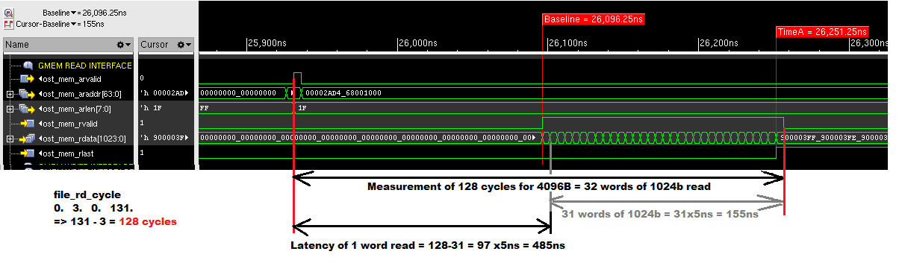
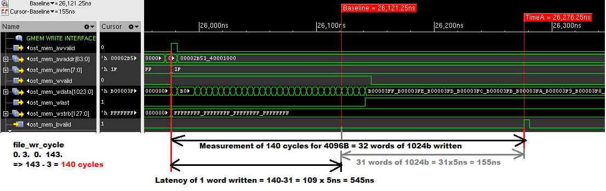

# hdl_single_engine

A very simple Verilog written example to interface server with an FPGA AXI-lite slave and AXI-master in order to evaluate/measure the bandwidth and latency of the OPENCAPI.

## Code location:

Code can be found at: [https://github.com/OpenCAPI/oc-accel/blob/master/actions/hdl_single_engine/](https://github.com/OpenCAPI/oc-accel/blob/master/actions/hdl_single_engine/) 

## Latency Evaluation

Single Engine test offers a simple way to evaluate latency.

**Simulation** can be used to better understand the evaluation mechanism, as [OCSE](./../../user-guide/6-co-simulation/ ) can emulate the server behavior.

The FPGA generates a sequence of 128Bytes words read or write operations from/into the server memory.

The routine launches a counter whose initial and end values can be read afterwards in dedicated registers.

Each counter increment represents 5ns.

A file is automatically written by the test sotfware to store the initial and end values.

The difference represents a complete multiple words operation, so a short calculation is required to obtain the minimum time required to read/write 1 single word.


Here are examples of commands and associated simulations to evaluate latency on a OC-AD9H3 card in an IBM IC922 server and associated simulations:


#### Read of 4096B at default memory location provided by the server:


Make sure `make apps` has been run from your oc-accel directory

```
cd oc-accel/action/hdl_single_engine/sw
./hdl_single_engine -c 100 -w 0x00000601 -n1 -N0 -p 0x00001F07  -t 100000 -C5
cat file_rd_cycle
    arid,           rd_cmd,      rid,          rd_resp
       0,				 3,		   0,		   	   131
```

131-3   * 5 ns = 640ns for the total 32 words read time.

We then substract 31 * 5 ns = 155ns to obtain 485ns read time for the first word. 

**Minimum latency  in this configuration is thus 640ns for 4kB read and 485ns for the first 128B word read.**


Associated read simulation chronogram:




#### Write of 4096B to default memory location provided by the server:

Make sure `make apps` has been run from your oc-accel directory

```
cd oc-accel/action/hdl_single_engine/sw
./hdl_single_engine -c 100 -w 0x00000601 -n 0 -N1 -p 0x00001F07  -t 100000 -C5
cat file_wr_cycle
 -- Counter values for different signals --
    awid,           wr_cmd,      bid,          wr_resp
       0,				 3,		   0,		   	   143
```

140 * 5 ns = 700ns for the total 32 words write time.

We then substract 31 * 5 ns = 155ns to obtain 545ns read time for the first word. 

**Minimum latency in this configuration is thus 700ns for 4kB written and 545ns for the first 128B word written.**


Associated read simulation chronogram:




## Bandwidth Evaluation

Using following test commands allow to get a summary of R/W measured bandwidths of a OC-AD9H3 card installed in a IBM IC922 server:

Make sure `make apps` has been run from your oc-accel directory

```
cd oc-accel/action/hdl_single_engine/sw
./hdl_single_engine -c 50 -w 0x00000601 -n100000 -N0 -p 0x00001F07  -t 10000 -C5 -v
Read average bandwidth (Host->FPGA): 409600000 bytes in 20172 usec ( 20306.844 MB/s )
Read bandwidth min, max and variance: 409600000 bytes in 20172 usec ( 20303.361 MB/s, 20313.430 MB/s, 3.131 )
```

Above we can check the **read only bandwidth** is around **20GB/sec**.

```
./hdl_single_engine/sw/hdl_single_engine -c 50 -w 0x00000601 -N10000 -n0 -p 0x00001F07 -t 10000 -C5 -vv
Write average bandwidth (FPGA->Host): 40960000 bytes in 1894 usec ( 21611.797 MB/s )
Write bandwidth min, max and variance: 40960000 bytes in 1894 usec ( 20940.695 MB/s, 21671.958 MB/s, 9266.666 )
```

Above we can check the **write only bandwidth** is around **21GB/sec**.

```
./hdl_single_engine -c 50 -w 0x00000601 -n100000 -N100000 -p 0x00001F07  -t 10000 -C5 -v
Duplex average bandwidth: 409600000 bytes in 22281 usec ( 18415.290 MB/s )
Duplex bandwidth min, max and variance: 409600000 bytes in 22281 usec ( 18383.376 MB/s, 18710.886 MB/s, 2986.513 )
```

Above we can check the **duplex read and write bandwidth** is around **18GB/sec**.

## Command arguments details : 

- `-c 100` : perform 100 tests. eg to initiate the path and get an average latency
- `-w 0x00000601` : setp the configuration to read 4096
- `-n1` : n read operations requested (1 here)
- `-N0` : N write operations requested (0 here)
- `-p 0x00001F07` : p stands for "pattern", can be anything.
- `-t 100000` : t stands for "time out" in seconds
- `-C5` : C stands for "Card", here we choose the card number 5 in the server

# Conclusion

Once again, we can easily use simulation to evaluate future performance of CAPI/OPENCAPI hardware, and a simple example provided allow any user to double check the results.

**Such latency and bandwidth results obtained without software driver are unique at the time of writing.**

