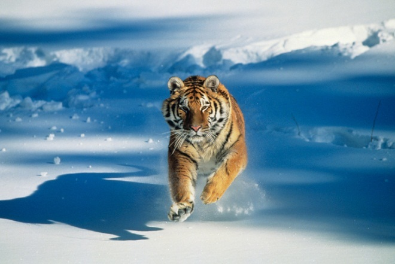

# hls_image_filter
This is an action is an example converted from CAPI2 and thus using HLS, 512 bits bus wide towards OpenCAPI interface which is 1024 bits wide.

To achieve this a 1024 to 512b converter is introduced, as P9 OpenCAPI uses a 1024 bits wide bus.

This allows older actions to be converted in a snap at the cost of lower performance.

The goal is to convert into grayscale the pixels from a bitmap file when they contains too much red component. Other pixels are left unmodified.

