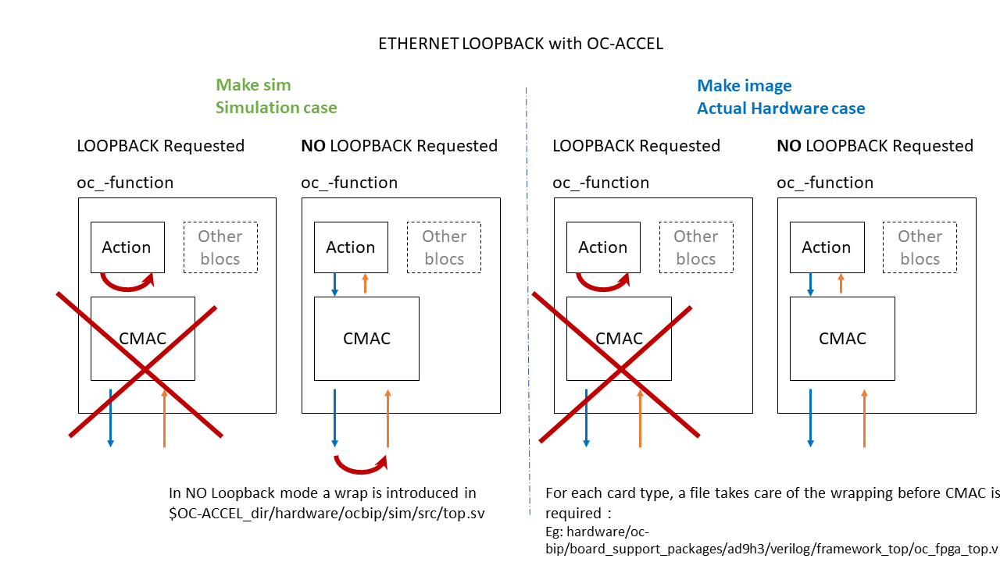

# hls_udp_512


## Code location:

Code can be found at:[https://github.com/OpenCAPI/oc-accel/blob/master/actions/hls_udp_512/](https://github.com/OpenCAPI/oc-accel/blob/master/actions/hls_udp_512/) 

## In short:

This example:

- provides a simple base to send and receive data to/from UDP frames
- allows to use a CMAC providing high speed data transfer capability.

The data inserted in the UDP frame are concatenated in *make_packet* function of *hw/hls_udp.cpp* file.

Internally generated sample packets are then sent through an AXI stream to the ethernet CMAC layer. 

The data extracted are processed and verified in *read_eth_packet* function of *hw/eth_decode.cpp* file.

The test *test/hw_test.sh* expects packets to be internally or externally "loopback" returned to compare them and thus checks the complete CMAC path.

This code is a simplified version of the hls_rx_100G function designed by Paul Sherrer Institute

It can be checked in /action.Kconfig file that the ACTION_HALF_WIDTH bloc is used for this example, so the interface uses the OpenCAPI 512 bit bus.

## Prerequisites:

As CMAC IP is under licence, make sure your license file is up-to-date.

## Loopback modes

For debug purpose, an internal loopback can be selected, avoiding to use the CMAC layer, thus reducing synthesis and/or routing time.



<center>fig 1 : loopback settings</center>


!!!Note
    In simulation the CMAC bloc is always in loopback mode when selected.

## Some Details

!!!Note
    Only one CMAC bloc is available and only in OC-AD9H3 card at the time of writing.

The main application software will tune the number of packets to read, the MAC Address and the IP of the FPGA.
All these exchanged data are contained in a structure defined in https://github.com/OpenCAPI/oc-accel/tree/master/actions/hls_udp_512/include/action_udp.H and shared with the hardware.

In return hardware will provide simple statistics.

```
/* Data structure used to exchange information between action and application */
/* Size limit is 108 Bytes */
typedef struct rx100G_job {
    struct snap_addr out_frame_buffer;
    uint64_t packets_to_read;
    uint64_t read_size;
    uint64_t bad_packets;
    uint64_t ignored_packets;
    uint64_t good_packets;
    uint64_t fpga_mac_addr;
    uint32_t fpga_ipv4_addr;
    uint32_t user;
    uint32_t mode;  
    uint32_t dummy;    // to align with 8 bytes
} rx100G_job_t;
```

The hardware is defined using a C description in 

https://github.com/OpenCAPI/oc-accel/tree/emac_2020_1/actions/hls_udp_512/hw

The example uses streams to output (input) hardware built packets into (from) CMAC.

