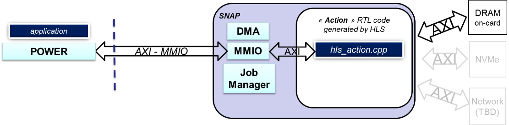

# Application Note : How data is managed in oc-accel

By IBM Systems Group
November, 2020

Authors : OpenCAPI Support Team - Montpellier, FRANCE

## Introduction

This Guide describes how to use, declare and optimize data variables in the SNAP environment. 

To understand without any ambiguity all the explanation provided in this document, let’s recall the basics:

- an **application** is the program running on the host server and executed on a **CPU**
- an **action** is the program running on the **FPGA**

## Foreword

We will use *SNAP* word from time to time as it was the former name of the framework used with the previous versions of CAPI1.0 & CAPI2.0 technologies. 

Since OpenCAPI (sometimes called CAPI3.0) is the 3rd generation of CAPI, some former SNAP names can be found. Most of them have been changed though (eg *snap_maint* became *oc_maint*).

## Overview

Even if you use a standard language like C or C++, porting a program on to an FPGA requires understanding some important concepts about how data flows or is accessed. The FPGA has no Operating System which means that standard use of data in code executed on a CPU will require, on an FPGA, a formal read or write access to the physical resource. Understanding this key point will help the user to define not only which **path** to use to exchange data between the application and the action, but also the **way** to access so that you can easily and efficiently access the data.

This document will successfully go through the following items:

- understand the ways for an **action** to exchange data with an **application**
- understand the ways for an **action** to exchange data with **all different resources**
- understand the control logic used by SNAP to manage different actions

## Actions interfaces

### Configuration of an action by an application

The first key point to remember is that with OpenCAPI, an action executed on the FPGA doesn’t need a software driver, which means that the application will NOT send the data to the action, since the action will access data on its own. The action will get information from the application as to where the required data is located. 
A second key point to remember is that, thanks to OpenCAPI, when an address is defined and used in the application, the same address will be usable without any modification in the action.
In other words, let’s take the example where a user wants to process 2 tables of data in the action, one located in the host server memory and one in the FPGA DDR memory. The application will fill a structure (Action registers) to tell the action where the required data is located, and where the action should write the result. Any other parameters can be added to control the action if needed. 

This structure exchanged between the application and the action is prepared by the application and sent before starting the processing. We will use the “MMIO” interface to read or write these settings. They can be dynamically changed during the processing since this interface is asynchronous to all other interfaces.

### Transferring data from/to an action 

The primary goal of the OC-ACCEL framework is to simplify the coding of the action which is implemented on the FPGA. Therefore, accessing several types of resources such as Host server memory, FPGA board DDR3 or DDR4, FPGA board Flash/NVMe/HBM memory needs to be standardized for the programmer by abstracting out the lower level details of each resource type. The other reason for this layer of abstraction is to prevent the user having to modify high level code when a new version of a resource type or a new resource type is added to the system. 

A common standard and simple interface, named as AXI4 (Advanced eXtensible Interface release 4.0 developed by ARM), has been chosen to interface all the resources that an action needs to work with. This means that OC-ACCEL provides in its internal logic the driver to interface the different resources. If one (or more) of these resources is not used or not present on the board, the associated AXI driver to this resource can be disabled so that only used logic is implemented. Also, if a new resource is added to the system, the associated AXI driver can be added to the FPGA while the high-level user code stays as is, since it deals with the AXI abstraction layer.

As described in Xilinx UG761 document, this AXI4 protocol has 3 types:

- AXI (or AXI_mm) – for high performance memory mapped requirements
- AXI-Lite – for simple, low-throughput memory mapped communication (typically used for control and status registers)  
- AXI-Stream – for high-speed streaming data

In OC-ACCEL:

- **AXI_mm** is used for all data that is exchanged with external resources.
- **AXI-Lite** is used for status and control registers (MMIO).
- **AXI-stream** is used for example when connecting a network driver.

## AXI data: the data “highway”

Let’s start with the AXI data interface which allows data to be exchanged on a high-speed interface.

### Types of resources

Three types of resources can be listed as:

1. Common resources: Host server memory:
   unidirectional port IN + 1 unidirectional port OUT 
2. FPGA specific resources:FPGA memory, named as BRAM:
   for example, a Xilinx KU060 has 3.5MB of memory used for user code variables.
3. Board specific resources (for example):
   AlphaData ADM-PCIE-9H3: 
     HBM, 2 100Gb Ethernet cages
   Bittware 250-SOC:
     Zync processor

Two important points to highlight:

- **Action code accesses all resources using a unique AXI protocol** which abstracts out the specific protocols of each of the resources.
- **“Board resources” are NOT known or seen by the application** running on the server. These resources can be managed by the Host application or by the action but need to be managed by one or the other.

### “Size” of the interfaces

To ease the use of these different resources by the action code, and reduce the latency to access them, the choice has been made in OC-ACCEL that all resources are accessed with a **data width set to a fixed value defined by “snap_membus_XXX_t”**. This XXX depends on the chosen bus width and data type are defined in this file:

[https://github.com/OpenCAPI/oc-accel/blob/master/actions/include/hls_snap_1024.H](https://github.com/OpenCAPI/oc-accel/blob/master/actions/include/hls_snap_1024.H)

This means that a full word read from or written to the host server memory or the FPGA DDR will either be 512 bits / 64 Bytes or 1024 bits / 128 bytes data in physical size. We will see soon how to deal with this “constraint”.

### Ports declaration

All actions provided as examples in OC-ACCEL have the “ports” defined the same way. Remember that hls_action is a reserved name that is used by OC-ACCEL logic to find the top file of the code.
~oc-accel/actions/hls_*/hw/action_*.cpp:
All unused ports can be commented except the ports of the host memory declared as “din_gmem” and “dout_gmem” which needs to remain active. 

“din_gmem” is the unidirectional port through which all data read from the Host server memory will enter the action. 

“dout_gmem” is the unidirectional port through which all data written to the Host server memory will exit the action.

The port “d_ddrmem” is bidirectional which means that data read from or written to the FPGA board DDR will flow through this port. 

The port can address DDR3 or DDR4 types of memory since the OC-ACCEL logic will adapt automatically the right driver to the right type of DDR (card dependent). 

The port “d_nvme” is a control port used to define the access to the NVME. All data are read and written through the DDR memory, used as a cache. Therefore, if the action needs data from the NVMe, it sends a read request of X bytes at a NVMe address, and the DDR will be filled with a block containing the data requested. The reason of this architecture is that the NVMe has a large latency and accessing it directly would slow the action program execution. 

More explanation can be found in the document provided in the former CAPI environement SNAP NVME example:
 https://github.com/open-power/snap/blob/master/actions/hls_nvme_memcopy/doc/UG_SNAP_hls_nvme_memcopy_v1.0.pdf 

### Ports definition

In the top-level module hls_action of each hardware action, after their declaration, all the ports are defined as 

`“#pragma HLS INTERFACE m_axi”` ports.

This type of definition is used for data path using the AXI4 protocol:
Every port is defined with the name that will be used in the code to access it (din_gmem, dout_gmem, d_ddrmem, d_nvme). 

The declaration of the bundle is the prefix of the name of the signal which will be used by the logic to connect to the different physical interfaces through a wrapper. Modifying this bundle name will prevent your logic from being connected to the OC-ACCEL wrapper.
The parameters (slave_depth, max_read_burst_length, max_write_burst_length) are set for the Xilinx HLS tool to overwrite default settings and get the maximum AXI burst (4KB). 
Refer to Xilinx UG902 Vivado HLS user guide for more details on these options.

[...]

