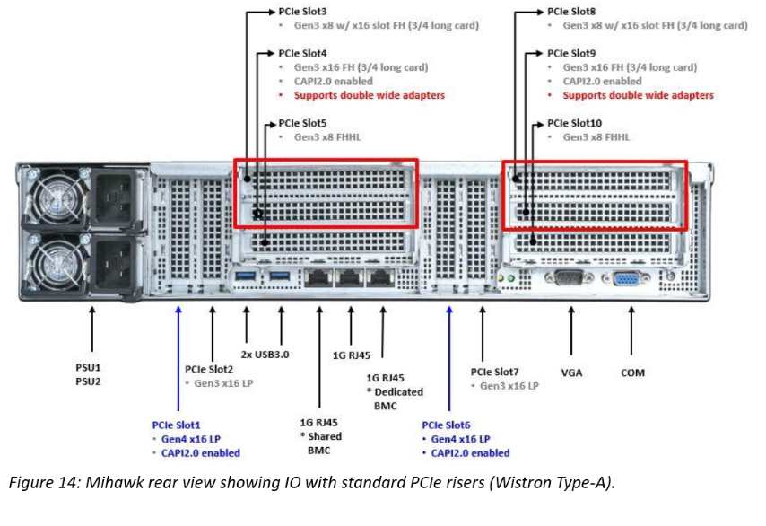
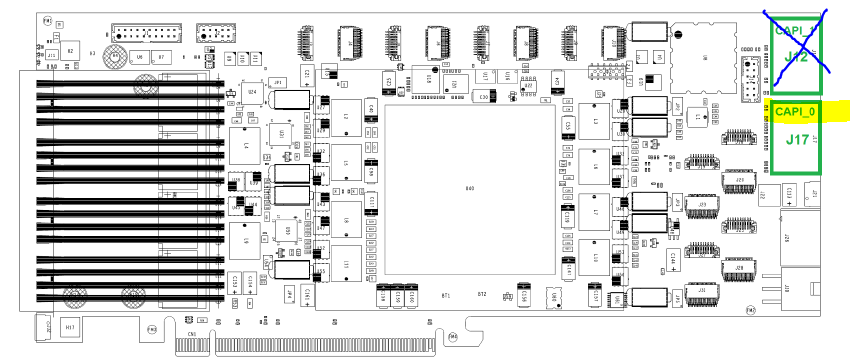

# Application Note : OpenCAPI Quickstart Installing an OC-AD9H7 on IC922

OpenCAPI QuickStart OC-AD9H7 on IC922

By IBM Systems Group
November, 2020

Authors : OpenCAPI Support Team - Montpellier, FRANCE

## Foreword

We will use *SNAP* word from time to time when mentionning the framework used with the previous versions of CAPI1.0 & CAPI2.0 technologies.

Since OpenCAPI (sometimes called CAPI3.0) is the 3rd generation of CAPI, some former SNAP names can be found. Most of them have been changed though (eg *snap_maint* became *oc_maint*).

The supplier reference is ADM-PCIE-9H7, we will use OC-AD9H7 in OC-ACCEL.

## IC922 Hardware Setup

Unlike CAPI2.0, OpenCAPI (OC) doesn’t use PCI links, however, the card requires PCIe power supply and mechanical socket to work.
An OC card can thus be theoretically installed in any PCIe socket.
As the OC card can also be used in CAPI2 mode, Figure 1 indicates the slots where is can be placed for CAPI2/OpenCAPI dual usage. 

Note that since OC-AD9H7 is 3/4 height it can only be placed in slots 4 and 9 using:

- either a special Wistron riser
- or a mechanically modified original riser.



Figure 1. Rear view of a IC922 system with PCIe CAPI enabled slots indicated

Please check details at:

[https://www.ibm.com/support/knowledgecenter/en/9183-22X/p9iaf/p9iaf_pcie_slot_details.htm]: https://www.ibm.com/support/knowledgecenter/en/9183-22X/p9iaf/p9iaf_pcie_slot_details.htm

https://www.ibm.com/support/knowledgecenter/en/9183-22X/p9iaf/p9iaf_pcie_slot_details.htm


## OC-AD9H7 board Setup

The OC-AD9H7 has an octuple DIP switch SW1, located on the rear side of the board. Check that all switches are configured to default settings (all "OFF"), but SW1-6 at "ON". We don’t use these VPD data in SNAP/OC.

At the time of writing, only one OpenCAPI link can be configured with oc-accel. So please only connect CAPI_0 connector only.




Information come from Alphadata web site:

- [https://www.alpha-data.com/dcp/products.php?product=adm-pcie-9h7](https://www.alpha-data.com/dcp/products.php?product=adm-pcie-9h7)
- [https://www.alpha-data.com/pdfs/adm-pcie-9h7%20user%20manual_v1_3.pdf](https://www.alpha-data.com/pdfs/adm-pcie-9h7%20user%20manual_v1_3.pdf)


## Setup tools on the POWER server environment

Setup the followings to get your environment on the Power server

1)	Clone the oc-accel framework (no contribution mode)

```
git clone https://github.com/OpenCAPI/oc-accel.git
```

 Clone the oc-accel framework (contribution mode using ssh)

```
git clone git@github.com:OpenCAPI/oc-accel.git
```

2)	Install the libocxl libraries + reboot the server after installation. 

(for ubuntu) 

```
sudo apt-get install libocxl-dev
```

(for RHEL) 

```
sudo yum install libocxl-devel
```

(libcxl-devel package is provided by RedHat Optional repository)   
3)	Clone the FPGA Image loader

```
sudo git clone  https://github.ibm.com/OC-Enablement/oc-utils/ 
cd oc_utils
sudo make install 
```


## Privileges

Important: libocxl requires root privileges to allow card exchanges (like oc-reset, oc_maint, usage in general).

When using the card without sudo privileges, you get an normal error.

Your administrator can provide user privileges using this process:

- Permanently create a /etc/udev/rules.d/20-ocaccel.rules file including:

  ```
  SUBSYSTEM=="ocxl", DEVPATH=="*/ocxl/IBM,oc-snap*", MODE="666", RUN="/bin/chmod 666 %S/%p/global_mmio_area"
  ```

- Reboot
  

## Check that the cards are recognized as accelerators

Check that the cards are recognized by the Firmware and the OS

```
lspci|grep accel
0006:00:00.0 Processing accelerators: IBM Device 062b
0006:00:00.1 Processing accelerators: IBM Device 062b
```

In this example, for this card, physical port is 0 and virtual port is 6.
If no card is found with this command, then your OC-9H7 card may not have a OpenCAPI image in it, or your firmware is too old.

Here is an example of 2 cards used in a P9 server one being recognized as CAPI2 the other as OC :

```
lspci|grep acc
0006:00:00.0 Processing accelerators: IBM Device 062b    #OC
0006:00:00.1 Processing accelerators: IBM Device 062b
0008:00:00.0 Processing accelerators: IBM Device 0632 (rev 01) #CAPI2
0030:01:00.0 Processing accelerators: IBM Device 0477 (rev 02)
```


## First programming of a brand new OC-9H7 card (no CAPI image was ever installed)

There are several ways to program a OC-AD9H7 card. If no CAPI image was ever installed on this board, then you’ll need to follow these following instructions to set it once. Then you’ll be able to go faster using the next paragraph.

A basic test image for the OC-9H7 card’s FPGA can be obtained from IBM Box. Programming this image onto the card will require Xilinx Vivado version 2018.1 or newer and a usb cable. To do so, access the device from Vivado’s hardware manager and follow these steps:

Right click on the "xcvu37p_0" entry in the device list and select "add configuration memory device".

Select "mt25qu01g-spi-x1_x2_x4_x8" from the list of config mem devices.

When prompted, choose to program the config mem device.

In the subsequent menu, select the two .mcs files, followed by the two optional .prm files.

The programming should complete in a few minutes. Note that the card needs to be power cycled (i.e. by rebooting the system) before the new image will take effect. On some servers the fast reboot service is operational, a complete power cycle is necessary to make sure the card powers off.


## Standard programming of an OC-9H7 card (OC image already in it)

Images for the OC-AD9H7 card’s FPGA will be created from the OC-ACCEL environment and will be placed in  

```
~/oc-accel/hardware/build/Images
```

Once successfully synthesized. Then using the FPGA Image loader, you will program and reset the FPGA with your binary files using the following command:

```
sudo oc-flash-script oc_my_user_image.bin
```

Depending on the format of the FPGA board Flash devices, you may need 1or 2 binary files. OC-AD9H7 card needs 2 binary files noted as primary and secondary. You will so call the loader with the 2 files in the following order:

```
sudo oc-flash-script oc_my_user_image_primary.bin oc_my_user_image_secondary.bin
```

!!!Note
    At the time of writing oc-utils doesn't support online programming of OC-AD9H7 yet.
JTAG programming is required.

## Running the Test Image if card has been already programmed with a OC image

From the oc-accel directory, compile once the software and applications

```
cd oc-accel
git pull   # in case you already cloned earlier and want to stay up to date
make software apps
```

The default test which has been compiled in the Box’s image is a hls_hbm_memcopy1024 example.

```
oc_find_card -v -A ALL    #This should return the card position
OC-AD9H7 card has been detected in card position: 4
...
```

then let OC-ACCEL framework discover the cards and actions with the oc_maint command.

Mention the card slot number if different from 0 using -C option. 

This command needs to be run almost once after a reset and will return the action stated here as “HLS HBM Memcopy” (1024b)"

```
~/oc-accel/software/tools/oc_maint -v [-C4]
```

You can now:

- Either run the memcopy program doing any transfer you want. 

You will get the explanations on how to use this example by typing

```
~/oc-accel/actions/hls_hbm_memcopy_1024/sw/snap_hbm_memcopy
```

- or run automatic test of hls_hbm_memcopy_1024 using

```
~/oc-accel/actions/hls_hbm_memcopy_1024/tests/hw_throughput.sh -d INCR
```

which will give you the bandwidth measured between FPGA, host memory and on-board for different file size exchanged.