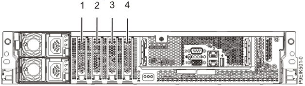

# Application Note : OpenCAPI Quickstart Installing an OC-AD9V3 on AC922

OpenCAPI QuickStart

By IBM Systems Group
November, 2019

Authors
Alexandre CASTELLANE, Fabrice MOYEN, Bruno MESNET,
OpenCAPI Enablement

## Foreword

We will use *SNAP* word from time to time when mentionning the framework used with the previous versions of CAPI1.0 & CAPI2.0 technologies.

Since OpenCAPI (sometimes called CAPI3.0) is the 3rd generation of CAPI, some former SNAP names can be found. Most of them have been changed though (eg *snap_maint* became *oc_maint*).

## AC922 Hardware Setup

Unlike CAPI2.0 OpenCAPI (OC) doesn’t use PCI links, however, the card requires PCIe power supply and mechanical socket to work.
An OC card can thus be theoretically installed in any PCIe socket.
As the OCcard can also be used in CAPI2 mode, Figure 1 indicates the slots where is can be placed for CAPI2/OpenCAPI dual usage.



Figure 1. Rear view of a system with PCIe CAPI enabled slots indicated

**As a reminder** and since both CAPI2.0 and OC cards can be used simultaneously, we provide the CAPI2.0 comptaible slots view:

| Slot identification and (location code)                      | Description			Coherent Accelerator Processor Interface (CAPI) | Adapter size             | Processor module                   | Coherent Accelerator Processor Interface (CAPI) |
| ------------------------------------------------------------ | ------------------------------------------------------------ | ------------------------ | ---------------------------------- | ----------------------------------------------- |
| 1 (P1-C5)		Half-height, half-length	Processor Module 1 / CPU1	No | PCIe4 x4                                                     | Half-height, half-length | Processor Module 1 / CPU1          | No                                              |
| 2 (P1-C4)                                                    | PCIe4 x8                                                     | Half-height, half-length | Processor Module 2 / CPU0 (shared) | Yes                                             |
| 3 (P1-C3)                                                    | PCIe4 x16                                                    | Half-height, half-length | Processor Module 2 / CPU0          | Yes                                             |
| 4 (P1-C2)                                                    | PCIe4 x16                                                    | Half-height, half-length | Processor Module 1 / CPU1          | Yes                                             |

Table 1. PCIe slot locations and CAPI2.0 compatibility in AC922

Please check details at:

[https://www.ibm.com/support/knowledgecenter/en/POWER9/p9eik/p9eik_pcie_slot_details.htm]: https://www.ibm.com/support/knowledgecenter/en/POWER9/p9eik/p9eik_pcie_slot_details.htm

[https://www.ibm.com/support/knowledgecenter/en/POWER9/p9eik/p9eik_pcie_slot_details.htm](https://www.ibm.com/support/knowledgecenter/en/POWER9/p9eik/p9eik_pcie_slot_details.htm)

The FPGA cards can be put in any of the PCIe slots 2, 3 or 4 which are CAPI enabled PCIe slots if you intend to use them in CAPI2.0 mode. **Slot 1 can also be used if only OpenCAPI mode is desired depending on the OpenCAPI connector position (for example 9V3 cannot be placed in slot1)**
Any half-height, half-length cards can be used. AD9V3 with the fan option may add mechanical restrictions in the choice of the slots.

**Important**: The slot 2 will only allow PCIe4 x8 configured cards. Even if the connector is a PCIe x16 connector, a PCIe3x16 board configured as PCIe3 x16 like AD9V3 is configured in SNAP per default cannot be put in this slot 2.

**Important**: If you expect to use an AD9V3 card in OpenCAPI3.0 mode, you will need to put it in slot 2 or 3 due to the length of the OpenCAPI cables and the OpenCAPI connector location specific to this card.


## OC adapter card

The OC card uses the same physical link as a GPU. An adaptation card is required to get the links hooked up to the card with a specific high speed connector.
The OC links cannot be used (firmware feature) with NVLINK, so using a OC card prevent using a GPU on the same socket.
If you configure in this configuration you’ll get the following message at the BMC :

```
[  104.351386662,3] NPU: NVLink and OpenCAPI devices on same chip not supported, aborting NPU init
Make sure you place 2 GPUs on one socket and one adapter on the other one, whichever you want.
```


## AD9V3 board Setup

The ADM-PCIE-9V3 has 2 quad DIP switch SW1 and SW2, located on the rear side of the board. Check that both switches are configured to default setting. SW2 all set to OFF works ok since we don’t use these VPD data in SNAP/OC.


[https://www.alpha-data.com/pdfs/adm-pcie-9v3%20user%20manual_v2_7.pdf]: h	"https://www.alpha-data.com/pdfs/adm-pcie-9v3.pdf"

Information come from Alphadata web site:

[[https://www.alpha-data.com/pdfs/adm-pcie-9v3.pdf](https://www.alpha-data.com/pdfs/adm-pcie-9v3.pdf)


## Setup tools on the POWER server environment

A general procedure is available [here](../setup_power_tools/ )

## Check that the cards are recognized as accelerators

Check that the cards are recognized by the Firmware and the OS

```
lspci|grep accel
0006:00:00.0 Processing accelerators: IBM Device 062b
0006:00:00.1 Processing accelerators: IBM Device 062b
```

In this example, for this card, physical port is 0 and virtual port is 6.
If no card is found with this command, then your 9V3 card may not have a OpenCAPI image in it, or your firmware is too old.

Here is an example of 2 cards used in the server one being recognized as CAPI2 the other as OC :

```
lspci|grep acc
0006:00:00.0 Processing accelerators: IBM Device 062b    #OC
0006:00:00.1 Processing accelerators: IBM Device 062b
0008:00:00.0 Processing accelerators: IBM Device 0632 (rev 01) #CAPI2
0030:01:00.0 Processing accelerators: IBM Device 0477 (rev 02)
```


## First programming of a brand new 9V3 card (no CAPI image was ever installed)

There are several ways to program a 9V3 card. If no CAPI image was ever installed on this board, then you’ll need to follow these following instructions to set it once. Then you’ll be able to go faster using the next paragraph.

A basic test image for the 9V3 card’s FPGA can be obtained from Box. Programming this image onto the card will require Xilinx Vivado version 2018.1 or newerand a Xilinx Platform Cable USB II ribbon programmer. To do so, access the device from Vivado’s hardware manager and follow these steps:

Right click on the "xcvu3p_0" entry in the device list and select "add configuration memory device".

Select "mt25qu256-spi-x1_x2_x4_x8" from the list of config mem devices.

When prompted, choose to program the config mem device.

In the subsequent menu, select the two .mcs files, followed by the two .prm files.

The programming should complete in a few minutes. Note that the card needs to be power cycled (i.e. by rebooting the system) before the new image will take effect.In very rare cases, a second reboot may be needed.


## Standard programming of a 9V3 card (CAPI image already in it)

Images for the 9V3 card’s FPGA will be created from the OC-ACCEL environment and will be placed in  

```
~snap/hardware/build/Images
```

Once successfully synthesized. Then using the FPGA Image loader, you will program and reset the FPGA with your binary files using the following command:

```
sudo oc-flash-script my_user_image.bin
```

Depending on the size of the FPGA board Flash devices, you may need 1or 2 binary files. AD9V3 card needs 2 binary files noted as primary and secondary. You will so call the loader with the 2 files in the following order:

```
sudo oc-flash-script my_user_image_primary.bin my_user_image_secondary.bin
```


## Running the Test Image if card has been already programmed with a OC image

From the snap directory, compile once the software and applications

```
cd oc-accel
git pull   # in case you already cloned earlier and want to stay up to date
make software apps
```

To "locally make" your software  you can set the default ACTION_ROOT variable.

The default test which has been compiled in the Box’s image is a hls_memcopy example.

```
export ACTION_ROOT=${HOME}/oc-accel/actions/hls_memcopy_1024
```

then set all paths automatically sourcing the script as follow:

```
source snap_path.sh # Find available card

oc_find_card -v -A ALL    #This should return the card position
OC-AD9V3 card has been detected in card position: 0
...
```

then let OC-ACCEL framework discover the cards and actions with the oc_maint command.

Mention the card slot number if different from 0 using -C option. 

This command needs to be run almost once after a reset and will return the action stated here as “IBM HLS Memcopy”

```
oc_maint -v [-C1]
```

You can now:

- Either run the memcopy program doing any transfer you want. 

You will get the explanations on how to use this exampleby typing

```
snap_memcopy
```

- or run automatic test of hls_memcopy_1024 using

```
./actions/hls_memcopy_1024/tests/hw_throughput.sh -d INCR
```

which will give you the bandwidth measured between FPGA, host memory and on-board for different file size exchanged.