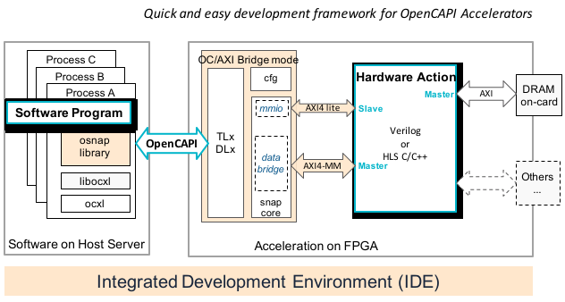

# OC-Accel Overview 


**OpenCAPI Acceleration Framework**, abbreviated as **OC-Accel**, the Integrated Development Environment (IDE) for creating application FPGA-based accelerators. By the nature of the FPGA, all these types of accelerators are reconfigurable.

The underlying enabling technology is OpenCAPI 3.0, the third-generation coherent interface allowing processing elements (Code running on CPU cores and accelerator logic implemented in FPGA chip) to seamlessly and coherently share host memory.

 All the code and related materials are contributed to Github here: <https://github.com/OpenCAPI/oc-accel>.

![conceptual_system] (pictures/conceptual_system.svg)
The predecessor to OC-Accel was [SNAP](https://github.com/open-power/snap) for CAPI 2.0 and CAPI 1.0.

## What is OpenCAPI

[OpenCAPI Consortium]: https://opencapi.org

OpenCAPI (Open Coherent Accelerator Processor Interface) is the third-generation coherent interface and is an open standard for coherent high-performance bus interface. Driven by emerging, accelerated heterogeneous computing and advanced memory and storage solutions, it provides the open interface that allows any microprocessor to attach to:

- Coherent user-level accelerators and I/O devices
- Advanced memories accessible via read/write or user-level DMA semantics

Its specifications and ecosystem are managed by the [OpenCAPI Consortium]. The reference designs are open source and available on Github at the <https://github.com/OpenCAPI/OpenCAPI3.0_Client_RefDesign> address.


## What can I do with OC-Accel

OC-Accel helps to easily create FPGA-based acceleration engines with OpenCAPI interfaces. More details and a step-by-step guide can be found in the "**User Guide**" tab.
Generally, creating an accelerator includes the following steps:


### Develop your accelerator

* Many applications are developed using only software. However, there are classes of real-time applications for which the software cannot process the required data in a prescribed time period.
* Analysis tools such as statistical performance monitors or profiling tools can help to identify compute-intensive algorithms. These algorithms are sometimes called bottlenecks, hotspots or choke-points. Examples of such choke points are: streaming IO, highly complex math functions, operations using extremely large block processing, etc.
* Adding dedicated and customized hardware to offload these compute-intensive functions greatly improve throughput. These "hot-spot" functions are moved to FPGA. These functions are also called "**actions**" in this description. 
* **Software/hardware partition**: After isolating the functions to run on FPGA side, the parameters need to be nailed down. This can be described as a `job` data structure. Learn the examples (see "**Examples**" tab) for a start. A few [libosnap API functions] will help you manipulate the FPGA card and the software/hardware interface. 
* **Work on the hardware action:** Write the "hardware action" in a supported programming language, such as Vivado HLS or Verilog/VHDL. Together with the software part which invokes this hardware action, OC-Accel supports running co-simulation to verify correctness. After the co-simulation is done, generate the FPGA bit image. 
* The development environment for OC-Accel is Linux with Xilinx Vivado installed. You can also install other supported simulators to get better simulation speed.
* The FPGA card (target hardware) is **NOT** required during architecture development.

[Profiling]: <https://en.wikipedia.org/wiki/Profiling_(computer_programming)>
[libosnap API functions]: ./deep-dive/software-api/
[Xilinx Vivado]: https://www.xilinx.com/support/download.html


### Deploy it and run

* **Deploy to Server**: Program the bit image to a real FPGA card. Compile the software code on OpenCAPI-enabled systems and run! 

## OC-Accel Framework

[repository structure]: ./repository/

Now let's have a glance at the diagram of OC-Accel framework. For more details about the directories, files and design hierarchy, see the [repository structure] page.



The framework hardware consists of:

* TLx/DLx: Transaction layer and Datalink layer of OpenCAPI device.
* cfg: Config subsystem of OpenCAPI
* snap_core: In Bridge mode, it provides the protocol translation for two directions. 
    * Module "mmio" converts TLx commands from Host Server to AXI4-Lite slave interface.
    * Module "bridge" converts AXI4-MM commands from User logic "Hardware Action" to the host.
  
* Hardware action: also named "action_wrapper" is where developers implement their accelerator logic. People can take this open-source framework to add other interfaces (for example, NVMe, Ethernet, HBM, etc) depending on the capabilities of the FPGA card. 

The framework software consists of:

* libosnap: a few user-space functions to talk to upper applications. Developers can define them freely.
* libocxl: a few user-space functions talking to kernel module ocxl.
* ocxl: Linux kernel module to support OpenCAPI hardware. Already included with the OS distributions. 

For more information, please refer to "**Deep Dive**" tab on the menu bar.


# Dependencies

## Required tools for development

Development is usually done on a **Linux (x86) computer**. 

* [Xilinx Vivado]: OC-Accel currently supports Xilinx FPGA devices exclusively. For synthesis, simulation model and image build, the Xilinx Vivado 2019.2 or newer tool suites are recommended.
* Build process: Building the code and running the make environment requires the usual development tools `gcc, make, sed, awk`. If not installed already, the installer package `build-essential` will set up the most important tools.
* Configuring the OC-Accel framework will call a standalone tool that is based on the Linux kernel [kconfig] tool. The `ncurses` library must be installed to use the simple menu-driven user interface for `kconfig`.
* `python` is optional but suggested to install. 2.7.x is fine.
* Simulators: You can use the build-in simulation `xsim` from Xilinx Vivado, or you can also use other simulators like Cadence `irun` or `xcelium`. 
* For simulation, OC-Accel also relies on the `xterm` program.
* Check the [System Firmware setup] page

[kconfig]: https://github.com/guillon/kconfig
[System Firmware setup]: ./system_firmware_setup


## Supported FPGA cards

OC-Accel framework needs a FPGA card with OpenCAPI interface, and <u>a Slim-SAS cable</u> to connect to the server. Today it supports:

[Alphadata 9V3]: https://www.alpha-data.com/dcp/products.php?product=adm-pcie-9v3
[Alphadata 9H3]: https://www.alpha-data.com/dcp/products.php?product=adm-pcie-9h3
[Alphadata 9H7]: https://www.alpha-data.com/dcp/products.php?product=adm-pcie-9h7
[Bittware 250-SoC]: https://www.bittware.com/fpga/250-soc/

* [Alphadata 9V3]
* [Alphadata 9H3]
* [Alphadata 9H7]
* [Bittware 250-SoC]

For FPGA vendors, it's easy to enable a new FPGA card with OpenCAPI interface to run OC-Accel, go to [New board support] page to learn how to.

## Supported Servers for deployment

OpenCAPI interface needs the support on the processor side. Today you can run OpenCAPI acceleration on POWER9 servers with LaGrange or Monza processors installed. Today you can choose:

LaGrange processor-based systems:

* IPS FP5290
* Wistron Mihawk
* IBM IC922

Monza processor-based systems:

* IBM AC922 (an Acorn card is also required in place of one GPU to get the OpenCAPI links)

Make sure your check the required firmware at [system_firmware_setup]

[system_firmware_setup]: ./system_firmware_setup.md


# How to report an issue

Submit an "Issue" on the GitHub. 

# How to search information

There are two ways: 

1. Use the "Search" button on the menu bar (up right). Or search the opened webpage by `Ctrl+F`.
2. Git clone this repository and use `grep` or any of your favorite tools to search "web-doc" folder in a terminal. All content on this website is plain text so you can search easily. For example:

```
cd web-doc
grep KEYWORD * -r
```

# Compliance with SNAP1.0/2.0

[CAPI technology]: https://developer.ibm.com/linuxonpower/capi/
[Migration Guide]: user-guide/9-migrate
[here]: https://github.com/open-power/snap/#31-fpga-card-selection

OpenCAPI is actually the third generation of [CAPI technology]. That's why its version starts from OpenCAPI3.0. The same acceleration frameworks for CAPI1.0 and CAPI2.0 are called SNAP1.0/2.0 and are available in an open-source git repository at the <https://github.com/open-power/snap> address.

The SNAP1.0/2.0 supported cards can be found [here].

* SNAP1.0 runs on POWER8 servers, with PCIe Gen3x8 cards. 

* SNAP2.0 runs on POWER9 servers, with PCIe Gen3x16 or PCIe Gen4x8 cards.

* OC-Accel runs on POWER9 servers, using OpenCAPI x8 interface. 

Generally, your actions running on SNAP1.0/2.0 can be moved to OC-Accel directly without changing source-code. Check [Migration Guide] for more information.


# From FPGA to ASIC

OC-Accel, together with the [OpenCAPI3.0 Device Reference designs], allow people to move their design from FPGA to ASIC easily in order to achieve higher clock frequency and logic density.

[OpenCAPI3.0 Device Reference designs]: https://github.com/OpenCAPI/OpenCAPI3.0_Client_RefDesign


OC-Accel has implemented many scripts based on the Vivado tool, but all the components and workflow scripts are open-sourced. The steps to construct a project and perform software/hardware co-simulation are clear and easy to manipulate. After replacing some Xilinx IPs (like PLL, RAM, DDR Controller and PHY Serdes) with the selected Foundry's IPs, the full oc_fpga_top design is suitable for ASIC tape out, resulting in an even higher-performance OpenCAPI ASIC device.


