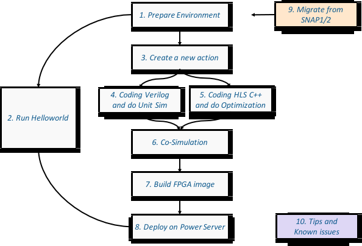

# Steps in a glance
Under "User-guide" menu, the pages/steps are organized in this way:

* If you are new to OC-Accel, please go through (1), (2), and (8). With running helloworld, you will get an idea about the workflow and basic operations quickly. 
* After that, it's time to create your own accelerator ("action"). Then go through (1), (3), (4/5), (6), (7), (8).
* If you already have an action developed in SNAP1/2 and want to move to OC-Accel, please read the notes in (9).
* Tips, possible developments and known issues are being updated in (10).

Go to [step 2] to use helloworld existing example

[step 2]: ./2-run-helloworld.md

Go to [step 3] to create your own case

[step 3]: ./3-new-action.md

Go to [step 9] Migration from SNAP1 or 2

[step 9]: ./9-migrate.md

