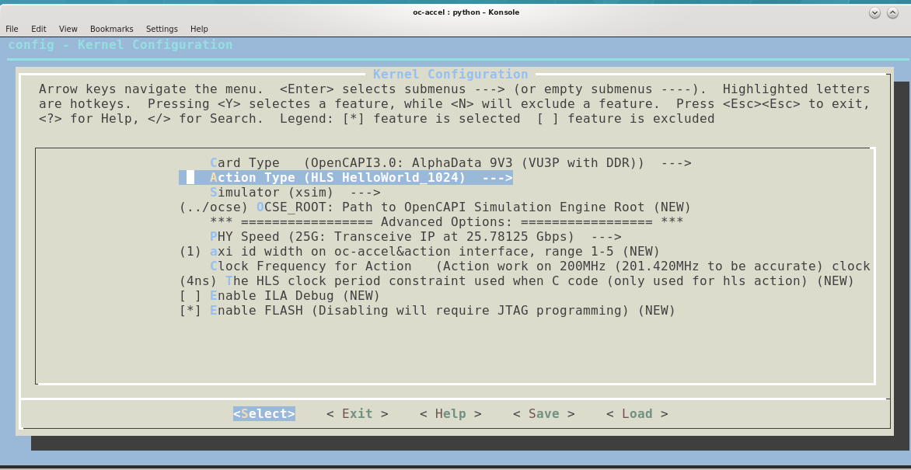
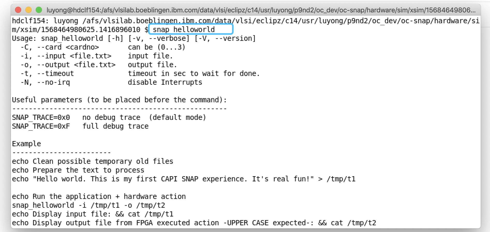
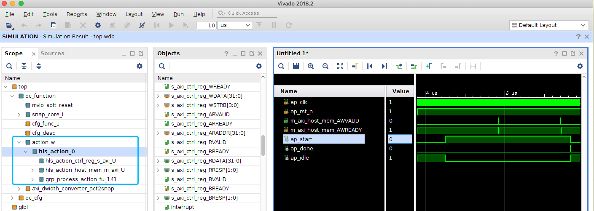

# Run hls_helloworld

## snap_config
```
cd oc-accel
# either run automated python script
./ocaccel_workflow.py
# or run step by step :
make snap_config
```
Then a KConfig window will popped up. If it doesn't, check [Required tools] and search 'kconfig' on the homepage.

[Required tools]: ../../#required-tools-for-development




Select HLS HelloWorld in "Action Type".


There are some other choices listed in the menu. Please check `OCSE_ROOT` path if default is not used. Select `xsim` (the default Vivado simulator).

To select a TRUE/FALSE feature, press "Y" or "N". After everything done, move cursor to "Exit".

!!!Note
    This Kconfig menu is editable. If you want to add new features or enrich your own menu, please edit `scripts/Kconfig` file.


Then it starts to execute many steps to build a simulation model. It needs several minutes. While waiting for it, open another terminal tab and try to get familiar with some environmental variables. Open `snap_env.sh` and check the very basic ones:
``` bash
export ACTION_ROOT=<path_of_oc-accel>/actions/hls_helloworld_1024
export TIMING_LABLIMIT="-200"
export OCSE_ROOT=<path_to_ocse>/ocse
```

- ACTION_ROOT should refer to your selected choice in the previous menu

- TIMINGS_LABLIMIT is refering to the hardware acceptation criteria. Should the hardware implementation not satisfy delay rules, for lab evaluation, we can afford to have some timings not fully respected in extreme conditions (voltages, temperature, etc ...).

  Having a -200ns is generally considered fair for evaluation purposes.

  Note that **0ns should be the production limit.** The actual value is reported at the end of the hardware preparation.

- Finaly check the **OC**-accel **S**imulation **E**ngine location.

## Simulation

If your were running in script mode:

**ocaccel-workflow.py** continues running and prints:

or simply run:

`make sim`


```
SNAP Configured
You've got configuration like:
	ACTION_ROOT	/home/castella/oc-accel/actions/hls_helloworld_1024
	FPGACARD	AD9V3
	FPGACHIP	xcvu3p-ffvc1517-2-e
	SIMULATOR	xsim
	CAPI_VER	opencapi30
	OCSE_ROOT	../ocse
--------> Environment Check
gcc	 installed as	/usr/bin/gcc
vivado	 installed as	/opt/Xilinx/Vivado/2019.2/bin/vivado
xterm	 installed as	/usr/bin/xterm
OCSE path /home/castella/ocse is valid
SNAP ROOT /home/castella/oc-accel is valid
Environment check PASSED
--------> Make the simulation model
Runnig ... check ./ocaccel_workflow.make_model.log for details of full progress
FINISHED! - [=============================] 100%
```
Then a Xterm window will pop up. (If it doesn't, check if you have installed it by typing `xterm` in your terminal.)


This Xterm window is where you run your application (software part). You can run anything as many times as you want in the xterm window, just like running in the terminal of a real server with FPGA card plugged.

!!!Warning
    If you want to save the content running in this xterm window, please use `script` before running any commands. When you exit xterm window, everything is saved to a file -- "typescript" is its default name.

```
$ script
Script started, file is typescript
...... Run Anything .....
$ exit
exit
Script done, file is typescript
```

Now let's run application **snap_helloworld**. It is located in `$ACTION_ROOT/sw`, where $ACTION_ROOT is `<path_of_oc-accel>/actions/hls_helloworld`. In the above window, it prints the help messages because it requires two arguments: an input text file and an output text file.

We have prepared a script in `$ACTION_ROOT/tests/hw_test.sh` and you can run it directly.

This example is asking FPGA to read the input file from host memory, converting the letters to capital case, and write them back to host memory and save in the output file.


Now you have finished the software/hardware co-simulation.

Type 'exit' in xterm window.

All the output logs, waveforms are in `hardware/sim/<simulator>/latest`.
```
hdclf154: luyong /afs/bb/u/luyong/p9/nd2/oc_dev/oc-accel/hardware/sim/xsim/latest $ ls
debug.log   ocse_server.dat  snap_helloworld.log  tin      webtalk.jou  xsim.dir  xsrun.tcl
ocse.log    shim_host.dat    tCAP                 top.wdb  webtalk.log  xsim.jou
ocse.parms  sim.log          terminal.log         tout     xsaet.tcl    xsim.log

```

And you can use following command to open the waveform.
```
xsim top.wdb -gui &
```


On the project scope (hierarchy) panel, the user logic is `action_w`.

## Make FPGA bit image

In above steps, you actually have finished steps of:

* make snap_config
* make model
* make sim

(These targets are introduced in [Traditional "make" steps])

[Traditional "make" steps]: ../1-prepare-env/#option2-traditional-make-steps

Now you can generate FPGA image by
```
./ocaccel_workflow.py --no_configure --no_make_model --no_run_sim --make_image
```

It takes about 2 hours or more. For some big design or bad-timing design, it takes even longer. Check the progress:

* `./snap_workflow.make_image.log`
* Or `hardware/logs/snap_build.log` for more detailed logs.

For example, `./snap_workflow.make_image.log` may tell you:

```
[BUILD IMAGE.........] start 16:58:57 Sat Sep 14 2019

A complete FPGA bitstream build got kicked off.
This might take more than an hour depending on the machine used
The process may be terminated by pressing <CTRL>-C at any time.
After termination it can be restarted later.

    open framework project                                      16:59:06 Sat Sep 14 2019
    start synthesis         with directive: Default             16:59:25 Sat Sep 14 2019
    start opt_design        with directive: Explore             17:18:58 Sat Sep 14 2019
                            reload opt_design DCP               17:27:19 Sat Sep 14 2019
    start place_design      with directive: Explore             17:28:23 Sat Sep 14 2019
    start phys_opt_design   with directive: Explore             17:42:58 Sat Sep 14 2019
    start route_design      with directive: Explore             18:04:55 Sat Sep 14 2019
    start opt_routed_design with directive: Explore             18:39:01 Sat Sep 14 2019
    generating reports                                          18:57:28 Sat Sep 14 2019
    Timing (WNS)            -11 ps
                            WARNING: TIMING FAILED, but may be OK for lab use
    generating bitstreams   type: user image                    18:58:28 Sat Sep 14 2019
```
So you can have an estimation of the progress.

After it's completed, you can find the FPGA bit image files in `hardware/build/Images`. The file names have the information of build date/time, action name, card type and timing slack (-11ps here).

```
$ cd hardware/build/Images
$ ls
oc_2019_0914_1657_25G_hls_helloworld_noSDRAM_AD9V3_-11.bit
oc_2019_0914_1657_25G_hls_helloworld_noSDRAM_AD9V3_-11_primary.bin
oc_2019_0914_1657_25G_hls_helloworld_noSDRAM_AD9V3_-11_primary.prm
oc_2019_0914_1657_25G_hls_helloworld_noSDRAM_AD9V3_-11_secondary.bin
oc_2019_0914_1657_25G_hls_helloworld_noSDRAM_AD9V3_-11_secondary.prm

```

!!!Note
    A small negative timing slack less than 200ps (set in variable $TIMING_LABLIMIT), is usually acceptable for Lab test, but for product, it's suggested to work out a timing cleaned FPGA image. See [Build image] for more information.

Then go to [Deploy on Power Server] to see how to download the bitstream and run.

[Build image]: ../7-build-image/
[Deploy on Power Server]: ../8-deploy/

## Summary
Now you understand how to run an existing example. You can use the same method to run other examples in `actions` directory.
